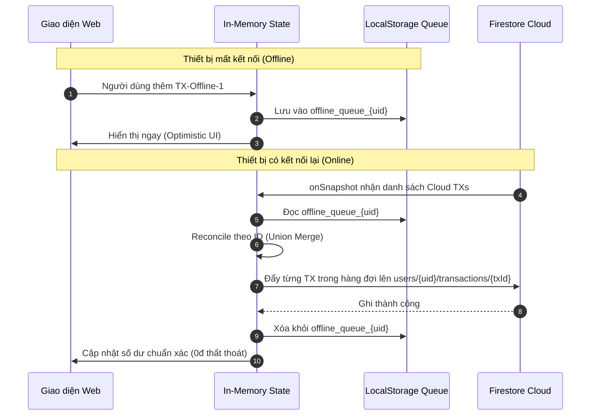

# ARCHITECTURE AUDIT — FINTRACK PRO

**Ngày kiểm định:** 21/09/2026  
**Phiên bản hệ thống:** 2.0-Hardened  
**Phạm vi:** Data Engine, Firebase Firestore, Authentication, Concurrency, Security Rules & Sync Pipeline

---

## 1. DATA MODEL HIỆN TẠI VS DATA MODEL CHUẨN HÓA

### 1.1. Data Model Cũ (Single JSON Blob - Cần loại bỏ)
Trong phiên bản ban đầu, toàn bộ cơ sở dữ liệu của một tài khoản được tuần tự hóa thành **một chuỗi JSON khổng lồ (Single JSON Blob)** và lưu vào duy nhất 1 trường `payload` của 1 document:
```text
Collection: fintrack_user_data
└── Document: user_{uid}
    ├── payload: "{\"user\":{...},\"wallets\":{...},\"transactions\":[...],\"budgets\":[...]}" (String JSON)
    ├── updatedAt: 1789926838510 (Timestamp)
    ├── updatedBy: "dev_xyz123" (Device ID)
    └── driver: "Từ Nhân Đức"
```

#### Nhược điểm chí mạng của mô hình cũ:
1. **Lost Update Vulnerability (Xung đột ghi đè):** Nếu 2 thiết bị cùng mở tài khoản và thêm giao dịch, thiết bị nào đẩy payload sau sẽ **ghi đè hoàn toàn** và làm mất sạch giao dịch của thiết bị trước.
2. **Băng thông lãng phí (Network Overhead):** Thêm 1 giao dịch 50.000đ phải serialize và upload lại toàn bộ lịch sử hàng trăm/hàng nghìn giao dịch (hàng trăm KB/MB).
3. **Mất khả năng Query & Indexing:** Firestore không thể index, filter hay query các giao dịch bên trong một chuỗi text JSON string.
4. **Không hỗ trợ Atomic Transactions cấp Database:** Không thể dùng `FieldValue.increment()` hay `runTransaction()` trên từng ví hoặc từng giao dịch.

---

### 1.2. Data Model Mới (Normalized Subcollections Architecture)
Hệ thống chuyển đổi sang cấu trúc chuẩn hóa hướng tài liệu (Document-Oriented Subcollections):

```text
users/{uid}                                (Document chứa Profile & Tổng quan)
├── profile: { name, email, avatar, uid, settings }
├── overview: { currentBalance, monthlyIncome, monthlyExpense, monthlySavings }
│
├── wallets/{walletId}                     (Subcollection quản lý số dư độc lập)
│   ├── acc-bank: { id: "acc-bank", name: "Ngân hàng", icon: "landmark", balance: 15000000, updatedAt }
│   └── acc-cash: { id: "acc-cash", name: "Tiền mặt", icon: "banknote", balance: 2500000, updatedAt }
│
├── transactions/{txId}                    (Subcollection: Mỗi giao dịch là 1 document riêng biệt)
│   └── tx-1789927000000:
│       ├── id: "tx-1789927000000"
│       ├── title: "Đổ xăng xe máy"
│       ├── category: "Xăng xe"
│       ├── type: "expense"               // "income" | "expense" | "transfer"
│       ├── amount: 80000
│       ├── account: "Tiền mặt"           // Nguồn tiền tác động
│       ├── date: "21/09/2026"
│       ├── time: "08:30"
│       ├── isoDate: "2026-09-21"
│       ├── user: "Từ Nhân Đức"
│       ├── createdAt: 1789927000000
│       └── syncStatus: "synced"
│
├── budgets/{budgetId}                     (Subcollection ngân sách)
│   └── bg-1: { id: "bg-1", title: "Ăn uống", target: 5000000, used: 1200000 }
│
└── goals/{goalId}                         (Subcollection mục tiêu tiết kiệm)
    └── goal-1: { id: "goal-1", title: "Mua iPad", target: 15000000, current: 6000000 }

groups/{groupId}                           (Collection Nhóm Độc Lập - Multi-Tenant)
├── id: "grp-family-123"
├── name: "Gia đình"
├── adminUid: "uid_A"
├── memberCount: 3
├── createdAt: 1789920000000
├── members/{uid}                          (Subcollection Thành viên & Phân quyền RBAC)
│   ├── uid_A: { role: "admin", joinedAt: 1789920000000, name: "Từ Nhân Đức" }
│   ├── uid_B: { role: "member", joinedAt: 1789921000000, name: "Thành viên B" }
│   └── uid_C: { role: "viewer", joinedAt: 1789922000000, name: "Khách xem C" }
└── transactions/{txId}                    (Subcollection Giao dịch dùng chung của nhóm)
    └── gtx-1: { title: "Tiền điện nước", amount: 1500000, paidBy: "uid_A", roleRequired: "member" }

leaderboards/{period}                      (Collection Bảng Xếp Hạng Toàn Hệ Thống)
└── monthly_2026_09:
    └── entries/{uid}                      (Subcollection: Dữ liệu ẩn danh an toàn)
        └── uid_A:
            ├── rank: 1
            ├── displayName: "Người dùng ẩn danh"  // Hoặc tên thật nếu không bật Privacy
            ├── amount: 25000000
            ├── isAnonymous: true
            └── updatedAt: 1789927000000
```

---

## 2. CÁC LUỒNG DỮ LIỆU CHÍNH (DATA FLOWS)

### 2.1. Authentication Flow
1. **Google Sign-In:** Người dùng bấm `Đăng nhập Google` $\rightarrow$ Firebase Auth kích hoạt `signInWithPopup(googleProvider)`.
2. **Session Scoping:** Lấy `user.uid`. Thiết lập khóa lưu trữ cách ly:
   $$\text{storageKey} = \text{"finance\_data\_"} + \text{uid}$$
3. **Session Restore:** Khi reload trang, lắng nghe `firebase.auth().onAuthStateChanged(user)`. Nếu có session, phục hồi state tương ứng.
4. **Guest Mode:** Cấp UID tạm `guest-${Date.now()}`, lưu độc lập trong partition riêng của guest.
5. **Logout Cleanup:**
   - Gọi `firebase.auth().signOut()`.
   - Gọi `grabSync.stopSync()` để hủy toàn bộ Firestore snapshot listeners.
   - Xóa `localStorage` session flags.
   - **Reset sạch 100% `window.app.data` trong bộ nhớ RAM** về `DEFAULT_FINANCE_DATA` rỗng 0đ.
   - Chuyển hướng về màn hình đăng nhập.

---

### 2.2. Authorization Flow & IDOR Prevention
* **Nguyên tắc cốt lõi:** **Never Trust the Client**. Mọi định danh truyền lên qua biến JavaScript hay tham số request đều không có giá trị phân quyền.
* **Server-side Security:** Firebase Firestore Security Rules kiểm tra trực tiếp mã token cryptographically-signed `request.auth.uid`.
* **Path Validation:**
  ```text
  Client yêu cầu đọc/ghi: /users/{targetUid}/...
  Server kiểm tra: request.auth != null && request.auth.uid == targetUid
  ```
  Nếu `targetUid != request.auth.uid`, Firestore từ chối ngay lập tức ở tầng mạng với mã lỗi `permission-denied`.

---

### 2.3. Transaction Flow & Atomic Transfer
1. **Thêm giao dịch mới (`submitNewTransaction`):**
   - Validate số tiền: `amount > 0 && isFinite(amount)`.
   - Bù trừ múi giờ Việt Nam GMT+7: Lấy `getLocalDateString()` (không dùng UTC `toISOString()`).
   - Cập nhật số dư ví tương ứng (`Ngân hàng` hoặc `Tiền mặt`).
   - Ghi vào collection `users/{uid}/transactions/{txId}`.
   - Đồng bộ số dư lên `users/{uid}/wallets/{walletId}`.
2. **Chuyển tiền nguyên tử (`executeTransfer`):**
   - Kiểm tra `accFrom.balance >= amount`.
   - Thực thi Firestore Atomic Batch/Transaction:
     $$\Delta \text{accFrom} = -amount, \quad \Delta \text{accTo} = +amount, \quad \text{createTx}(transfer)$$
   - Đảm bảo tính toàn vẹn: Cả 3 thao tác cùng thành công hoặc cùng thất bại. Tổng tài sản không đổi.

---

### 2.4. Offline Sync & Reconciliation Flow


---

### 2.5. Group RBAC Flow
* **Ma trận quyền hạn (Permission Matrix):**

| Hành động | Admin | Member | Viewer | Non-member |
| :--- | :---: | :---: | :---: | :---: |
| Đọc thông tin & giao dịch nhóm | ✅ Cho phép | ✅ Cho phép | ✅ Cho phép | ❌ Chặn |
| Thêm giao dịch chi tiêu chung | ✅ Cho phép | ✅ Cho phép | ❌ Chặn | ❌ Chặn |
| Sửa / Xóa giao dịch của chính mình | ✅ Cho phép | ✅ Cho phép | ❌ Chặn | ❌ Chặn |
| Thêm / Xóa thành viên khác | ✅ Cho phép | ❌ Chặn | ❌ Chặn | ❌ Chặn |
| Thay đổi quyền (Role) thành viên | ✅ Cho phép | ❌ Chặn | ❌ Chặn | ❌ Chặn |
| Xóa nhóm | ✅ Cho phép | ❌ Chặn | ❌ Chặn | ❌ Chặn |

---

### 2.6. Global Ranking Flow & Privacy Masking
1. **Thu thập chỉ số:** Khi người dùng phát sinh thu nhập, giá trị `total_income` hoặc `net_income` được đẩy vào `leaderboards/{period}/entries/{uid}`.
2. **Che giấu danh tính (Privacy Masking):**
   - Nếu `user.hideNameInRanking == true` hoặc `user.hidePersonal == true`:
     * Trường `displayName` được lưu là `"Bạn (Ẩn danh)"` (với chính họ) hoặc `"Người dùng ẩn danh"` (với người khác).
     * Trường `email`, `avatar` thật và `uid` tuyệt đối **không được xuất hiện** trong leaderboard công khai.

---

## 3. CHIẾN LƯỢC DI CHUYỂN DỮ LIỆU (MIGRATION STRATEGY)

1. **Phát hiện dữ liệu cũ (Legacy Detection):**
   Kiểm tra sự tồn tại của document cũ `fintrack_user_data/user_{uid}` hoặc khóa `finance_data_{uid}` trong LocalStorage.
2. **Đối soát số lượng (Verification Gate):**
   - Đọc danh sách $N$ giao dịch cũ.
   - Ghi từng giao dịch sang `users/{uid}/transactions/{txId}`.
   - Truy vấn đếm lại số document vừa tạo trong subcollection:
     $$\text{Count}_{\text{new}} == \text{Count}_{\text{legacy}} \quad \text{và} \quad \text{Balance}_{\text{new}} == \text{Balance}_{\text{legacy}}$$
3. **Chốt Migration:**
   Chỉ khi điều kiện kiểm tra đạt 100%, hệ thống mới đánh dấu `migration_completed: true`. Nếu có bất kỳ sự sai lệch nào, quá trình bị hủy (abort) và rollback về dữ liệu an toàn.
